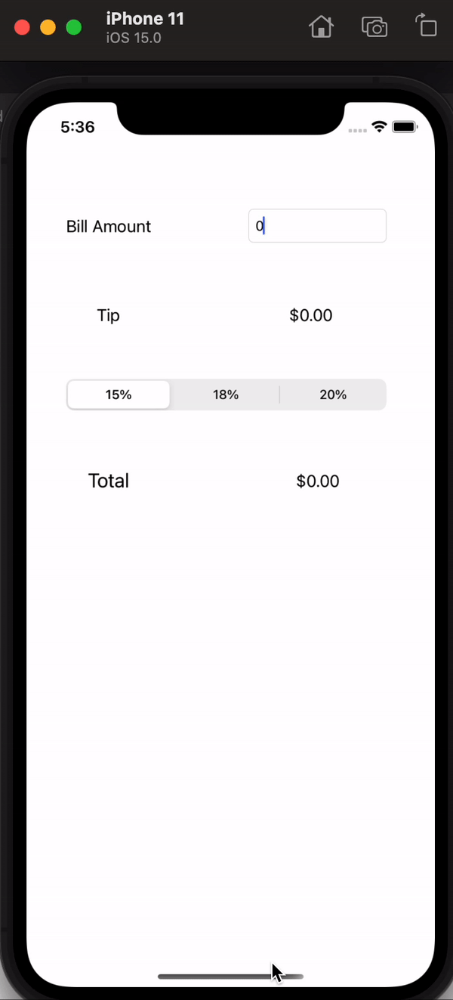

# Pre-work - *Tip Calculator*

**Tip Calculator** is a tip calculator application for iOS.

Submitted by: **David Em-Yinn**

Time spent: **1.5** hours spent in total

## User Stories

The following **required** functionality is complete:

* [ ] User can enter a bill amount, choose a tip percentage, and see the tip and total values.
* [ ] User can select between tip percentages by tapping different values on the segmented control and the tip value is updated accordingly

The following **optional** features are implemented:

* [ ] UI animations
* [ ] Remembering the bill amount across app restarts (if <10mins)
* [ ] Using locale-specific currency and currency thousands separators.
* [ ] Making sure the keyboard is always visible and the bill amount is always the first responder. This way the user doesn't have to tap anywhere to use this app. Just launch the app and start typing.

The following **additional** features are implemented:

- [ ] I would like to add a split bill functionality
- [ ] I would like to add a custom tip amount functionality

## Video Walkthrough

Here's a walkthrough of implemented user stories:

GIF created with Keynotes

## Notes

Describe any challenges encountered while building the app.
This was really easy thanks to the walk through steps; however, some of the challenges were to understand how xcode works.
Moreover, it took time to understand how the story board works, but xcode makes this really easy and intuitive. 

## License

    Copyright [2021] [David Em-Yinn]

    Licensed under the Apache License, Version 2.0 (the "License");
    you may not use this file except in compliance with the License.
    You may obtain a copy of the License at

        http://www.apache.org/licenses/LICENSE-2.0

    Unless required by applicable law or agreed to in writing, software
    distributed under the License is distributed on an "AS IS" BASIS,
    WITHOUT WARRANTIES OR CONDITIONS OF ANY KIND, either express or implied.
    See the License for the specific language governing permissions and
    limitations under the License.
